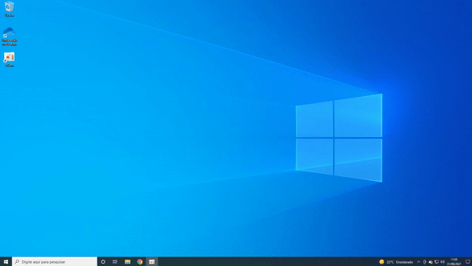

# setup-sumo-windows-10

Tutorial simples, para realizar a configuração da ferramenta de simulação SUMO (Version 1.10.0) em sistema operacional Windows 10.

## Pré-Requisito

- Python (3.7.8): eu realizei a instalação da versão 3.7.8 através do Visual Studio Installer mas pode ser que versões mais novas também funcionem.

## Instalação Sumo

No site oficial da ferramenta baixar a versão latest 64bit [aqui](https://sumo.dlr.de/docs/Downloads.php).

Depois avançar, avançar até o final sem alterar nada.

E por último adicionar os 3 endereços abaixo às variáveis de ambiente do sistema "PATH". 

## Importação de mapas 

Vídeo completo (e curto) demonstrando o funcionamento  [video](https://youtu.be/bqSr48y97o8)

## Resolução de problemas

Caso o processo de importação de mapas apresente erro, no meu caso bastou reinstalar com o mesmo instalador.

## Fonte

Canal Youtube de [EthanPng](https://www.youtube.com/watch?v=zQH1n0Fvxes&ab_channel=EthanPng). Acessado em Agosto 2021.