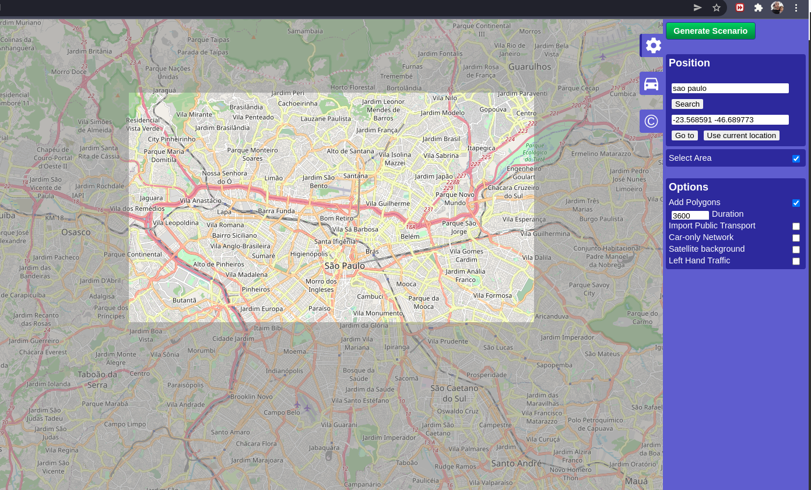

# setup-sumo-ubuntu

Tutorial simples, para realizar a configuração da ferramenta de simulação SUMO (Version 1.10.0) em sistema operacional Linux nas derivações Debian/Ubuntu.

## Pré-Requisito

Instalação do Python e outras libs úteis

    sudo apt-get install cmake python g++ libxerces-c-dev libfox-1.6-dev libgdal-dev libproj-dev libgl2ps-dev swig

## Instalação do SUMO

Download via repositório oficial

    sudo apt install git
    git clone --recursive https://github.com/eclipse/sumo

Setar variável de ambiente

    export SUMO_HOME="$PWD/sumo"
    nano .bashrc

Colocar essas duas linhas com o path de instalação do SUMO

    # ~/.bashrc: executed by bash(1) for non-login shells.
    # see /usr/share/doc/bash/examples/startup-files (in the package bash-doc)
    # for examples

    export PATH=$PATH:/home/alisson/sumo/bin
    export SUMO_HOME=/home/alisson/sumo

    # If not running interactively, don't do anything
    case $- in
        *i*) ;;
        *) return;;
    esac

Executar scritpts de configuração

    mkdir sumo/build/cmake-build && cd sumo/build/cmake-build
    cmake ../..
    make -j8

## Criando primeira simulação

Criar diretório de preferência

    cd home/user/Documentos/my_project

Criando rede de simulação com mapa importado do Open Street Map (OSM)

    /usr/share/sumo/tools/osmWebWizard.py

Colocar no campo de busca local desejado para a simulação, clicando em `Search`, com o resultado selecionar a área desejada e clicar em `Generate Scenario`.
Pode-se ainda escolher alguns itens opcionais para importar junto com a simulação como o sistema do transporte público e o tráfego de veículos gerados (caminhões, motos, trens, bicicletas etc...

## Fonte

ENGINEERING CLINIC[Installation of SUMO 1.2.0 in Ubuntu 18.04](https://www.nsnam.com/2019/06/installation-of-sumo-120-in-ubuntu-1804.html). Acessado em Dezembro 2021.

SUMO [doc Linux](https://sumo.dlr.de/docs/Installing/Linux_Build.html). Acessado em Dezembro 2021.

UNICAMP [tutorial Hello World](https://cst.fee.unicamp.br/sites/default/files/sumo/sumo-roadmap.pdf). Acessado em Dezembro 2021.
